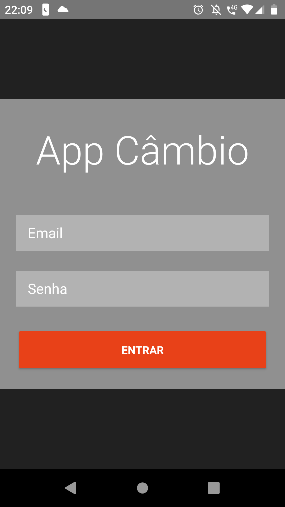
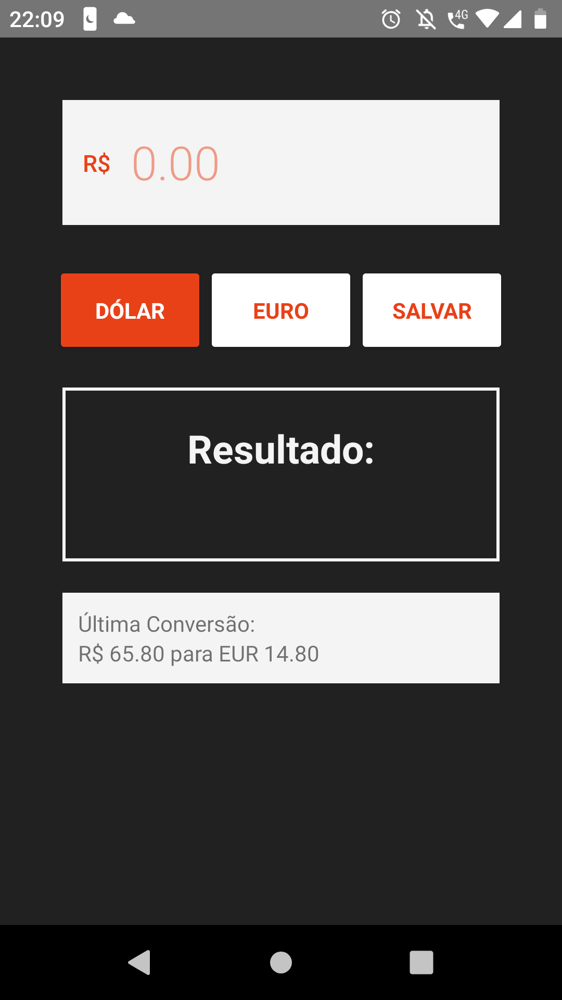

# App de Câmbio

Este app converte o valor de real para dolar ou euro, 
tem uma tela de login fake mas bem bonita.

### Pre-requisitos

```
É necessário instalar o Nativescipt em sua máquina comece
por aqui https://docs.nativescript.org/start/quick-setup
```

ou

```
Instale o Nativescript Playground e Nativescript Preview
e execute o código por 
```

### Como rodar o aplicativo

```
no prompt de comando na pasta do projeto execute o comando tns run android
```

## Authors

* **Henrique Amorim** - [App Câmbio](https://github.com/marcossaore/app-exercicio-imc)

## Telas

<br/>
<br/>
